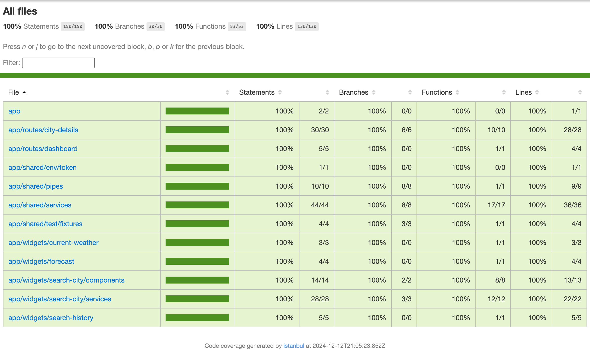

# Voxloud Homework Assignment: Weather Dashboard

## Objective
Build a simple weather dashboard application that displays detailed weather information for multiple cities.

## Feature Highlights
- **City Search with Autocomplete**: Allows users to easily find and select cities with an intuitive search experience.
- **Custom Angular Material Theme**: Implements a unique, visually appealing design tailored to the application.
- **Current Weather and Forecast**: Displays both real-time weather conditions and a multi-day forecast for added context.
- **Loading Indicators**: Provides visual feedback during city search and weather data retrieval.
- **Error Handling**: Displays user-friendly messages for issues like invalid city names or API errors.
- **Add to Favorites**: Users can mark cities as favorites, with persistent storage using Local Storage.
- **Comprehensive Test Coverage**: All features are covered by unit tests, ensuring robustness and reliability.
- **CI/CD with GitHub Pages**: Automated deployment ensures the latest version is always available online.

## Setup Instructions

### Prerequisites
Ensure the following tools are installed:
- **Node.js** (LTS version recommended)
- **Angular CLI**

### Installation Steps
1. Clone the repository:
   ```bash
   git clone https://github.com/AlexNixx/voxloud-test-task.git
   cd voxloud-test-task
   ```
2. Install dependencies:
   ```bash
   npm install
   ```
3. Obtain an API key from [OpenWeatherMap](https://openweathermap.org/api), [Amadeus](https://developers.amadeus.com) and set it in the environment file:
   ```
   src/environments/environment.ts
   ```
4. Start the application:
   ```bash
   npm run start
   ```
5. Open the app in your browser at `http://localhost:4200`.

---

## Testing
Run all unit tests:
  ```bash
  npm run test
  ```
Test coverage is **100%**.
  
---

## CI/CD Pipeline
- The project includes a fully automated CI/CD pipeline using **GitHub Actions**.
- On each push, the pipeline:
  1. Installs dependencies.
  2. Runs lint checks and unit tests.
  3. Deploys the application to **GitHub Pages** if tests pass.

---

## Live Demo
Access the live version of the Weather Dashboard: **[GitHub Pages Link](https://alexnixx.github.io/voxloud-test-task)**
